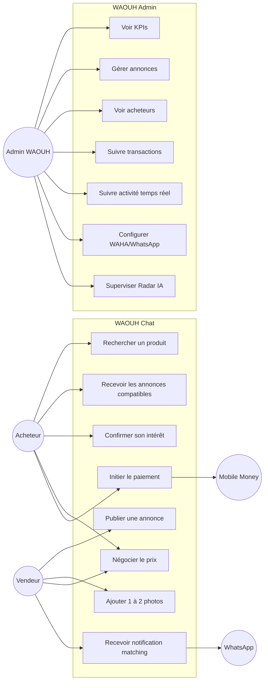
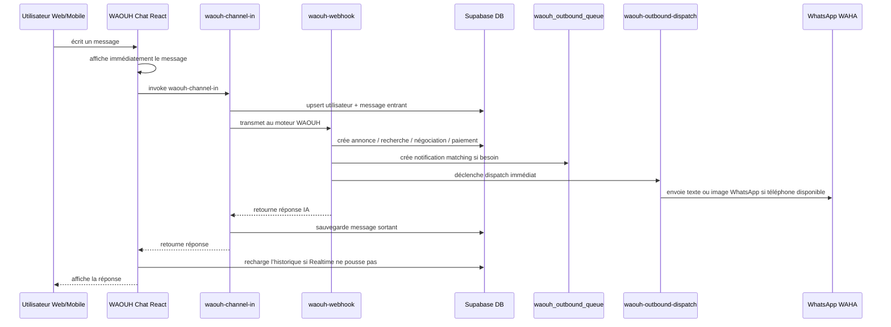

# Document fonctionnel — WAOUH Chat & WAOUH Admin

## 1. Objectif du module

WAOUH est un assistant marketplace conversationnel qui permet à un utilisateur de :

- publier une annonce de vente ;
- chercher un produit ;
- recevoir des propositions compatibles ;
- déclarer son intérêt pour une annonce ;
- négocier un prix ;
- initier un paiement Mobile Money ;
- recevoir des notifications de matching sur le Web et, si disponible, via WhatsApp.

Le module Admin permet de suivre les annonces, acheteurs, transactions, activité temps réel, paramètres et intégrations WhatsApp/Radar IA.

## 2. Canaux fonctionnels

### Web Chat

Route publique : `/waouh-chat`

Fonctionnel actuellement :

- conversation web mobile et desktop ;
- session anonyme persistante via `waouh_web_session_id` ;
- historique de conversation par session ;
- affichage immédiat du message envoyé ;
- affichage de la réponse même si Supabase Realtime est lent ou indisponible ;
- géolocalisation/ville par défaut ;
- upload de 1 à 2 photos pour une annonce ;
- notifications web de matching lorsque la session est active.

### WhatsApp

Fonctionnel actuellement côté backend :

- entrée de messages via WAHA/webhook ;
- envoi de réponses WhatsApp via WAHA `sendText` ;
- envoi d’image via WAHA `sendImage` lorsqu’une annonce contient une photo ;
- file de notifications sortantes `waouh_outbound_queue` ;
- dispatch immédiat après un événement de match/négociation.

Condition d’exploitation réelle : WAHA doit être connecté avec `WAHA_BASE_URL`, `WAHA_API_KEY` si activé, et une session WhatsApp opérationnelle.

## 3. Fonctionnement utilisateur

### Parcours vendeur

1. Le vendeur écrit par exemple : `Je vends ordinateur Lenovo 300000 FCFA à Cotonou`.
2. WAOUH détecte l’intention `SELL`.
3. L’IA extrait la fiche produit : titre, catégorie, marque, modèle, état, prix, description.
4. WAOUH crée une annonce active dans `waouh_articles`.
5. Si des photos sont jointes, elles sont enregistrées dans le bucket `waouh-uploads` puis liées à l’annonce.
6. WAOUH répond avec une confirmation de publication.
7. Les acheteurs compatibles peuvent être notifiés selon le matching disponible.

### Parcours acheteur

1. L’acheteur écrit : `Je cherche ordinateur Lenovo budget 300000 FCFA à Cotonou`.
2. WAOUH détecte l’intention `BUY`.
3. L’IA extrait les critères : mots-clés, catégorie, budget, rayon.
4. WAOUH crée un profil d’achat dans `waouh_buyer_profiles`.
5. WAOUH recherche les annonces actives compatibles.
6. Si des annonces existent, WAOUH retourne une liste numérotée.
7. Sinon, WAOUH sauvegarde la recherche et annonce une notification future.

### Parcours mise en relation

1. L’acheteur répond : `intéressé N°1`.
2. WAOUH récupère l’annonce correspondante depuis le contexte de conversation.
3. WAOUH crée une négociation dans `waouh_negotiations`.
4. Le vendeur reçoit une notification web ou WhatsApp selon son canal disponible.
5. Le message peut contenir la photo principale du produit.

### Parcours négociation

1. L’acheteur écrit : `Je propose 250000 FCFA`.
2. WAOUH met à jour la négociation.
3. Le vendeur reçoit la nouvelle offre.
4. Le vendeur peut répondre `OUI`, `NON` ou proposer un autre prix.

### Parcours paiement

1. L’acheteur écrit : `Je paye`.
2. WAOUH cherche la dernière négociation active.
3. WAOUH initie le paiement Mobile Money via la fonction de paiement configurée.
4. Une transaction est créée et affichée dans le chat via une carte de paiement.
5. Le paiement suit le modèle escrow : blocage puis libération après confirmation.

## 4. Diagramme de cas d’utilisation fonctionnel

## 5. Architecture fonctionnelle

## 6. Administration WAOUH

Route admin : `/admin/waouh`

Fonctionnel actuellement :

- tableau de bord avec KPIs ;
- annonces actives, vendues, expirées ;
- volume transactionnel ;
- commissions ;
- nombre d’utilisateurs ;
- top catégories ;
- densité par ville ;
- activité temps réel sur annonces et transactions ;
- liste des annonces avec filtres catégorie/statut/origine ;
- liste des acheteurs ;
- liste des transactions ;
- panneau WhatsApp WAHA ;
- onglet Radar IA ;
- paramètres WAOUH.

## 7. Ce qui est maintenant corrigé

Le bug mobile venait du fait que le chat dépendait principalement de Supabase Realtime pour revoir le message entrant/sortant dans l’interface. Quand le Realtime ne poussait pas l’événement assez vite ou pas du tout, l’utilisateur avait l’impression que le message n’était pas envoyé et que la réponse n’était pas reçue.

Correctif appliqué :

- affichage optimiste immédiat du message utilisateur ;
- récupération directe de la réponse retournée par `waouh-channel-in` ;
- rechargement de l’historique après l’appel backend ;
- fallback d’affichage de la réponse si l’historique n’est pas encore disponible ;
- restauration du texte et des pièces jointes si l’envoi échoue ;
- création garantie du `web_session_id` dès l’ouverture de la page pour les notifications.

## 8. État fonctionnel validé

Test mobile effectué sur `/waouh-chat` avec :

`je cherche ordinateur lenovo budget 300000 FCFA à Cotonou`

Résultat validé :

- le message s’affiche immédiatement ;
- l’appel `waouh-channel-in` répond en HTTP 200 ;
- WAOUH retourne des annonces Lenovo compatibles ;
- la réponse s’affiche dans le chat mobile ;
- le champ de saisie reste visible en bas de l’écran.

## 9. Ce qui reste à faire pour une exploitation commerciale complète

### Priorité haute

- Vérifier sur un vrai téléphone Android/iPhone hors preview Lovable après publication.
- Finaliser le contrôle qualité WhatsApp WAHA avec un vrai numéro vendeur et acheteur.
- Ajouter une page de monitoring dédiée aux erreurs WAHA, paiement et matching.
- Ajouter une modération admin des annonces : approuver, suspendre, supprimer, marquer vendu.
- Ajouter une preuve de livraison/réception avant libération escrow.

### Priorité moyenne

- Améliorer le matching automatique vendeur → acheteurs sauvegardés dès publication d’une annonce.
- Ajouter notification push web hors onglet actif avec VAPID.
- Ajouter filtres géographiques précis par distance réelle.
- Ajouter un statut de disponibilité du vendeur.
- Ajouter historique complet par conversation dans l’admin.

### Priorité basse

- Ajouter statistiques par canal : Web, WhatsApp, Radar, Facebook, groupes.
- Ajouter scoring qualité des annonces.
- Ajouter templates de réponse admin personnalisables.
- Ajouter export CSV/PDF des annonces, acheteurs et transactions.

## 10. Conclusion fonctionnelle

WAOUH Chat est fonctionnel pour rechercher, publier, matcher, négocier et initier le paiement depuis le Web Chat. L’administration permet déjà de suivre l’activité principale. Pour déclarer le module officiellement prêt à la vente en situation réelle à grande échelle, il reste surtout à durcir la supervision, la modération, les tests WhatsApp réels et les contrôles escrow/livraison.
